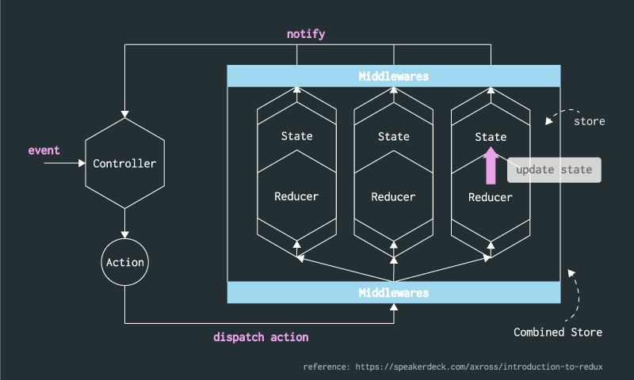

# Droidux
[](https://travis-ci.org/izumin5210/Droidux)
[ ](https://bintray.com/izumin5210/maven/droidux/_latestVersion)
[](https://github.com/izumin5210/Droidux/blob/master/LICENSE.md)
[](http://android-arsenal.com/details/1/2892)

Droidux is "predictable state container" implementation, inspired by **[Redux][redux]**.

## Features
Droidux is influenced by [Three principles][three-principles] of Redux.

> * Single source of truth
>     - The state of your whole application is stored in an object tree inside a single store.
> * State is read-only
>     - The only way to mutate the state is to emit an action, an object describing what happened.
> * Mutations are written as pure functions
>     - To specify how the state tree is transformed by actions, you write pure reducers.
>
> [Three Principles | Redux][three-principles]

Features of Droidux are following:

* All mutations can be observed via rx.Observable from [RxJava][rxjava]
* All mutations are automatically notified to views via [Data Binding][databinding]

### Data flow


see also: [Introduction to Redux // Speaker Deck](https://speakerdeck.com/axross/introduction-to-redux) (in Japanese)

## Installation
Droidux depends on [RxJava][rxjava] and [Data Binding][databinding].
Add to your project build.gradle file:

```groovy
buildscript {
  dependencies {
    classpath 'com.neenbedankt.gradle.plugins:android-apt:1.8'
  }
}

apply plugin: 'com.android.application'

dependencies {
  compile 'io.reactivex:rxjava:1.1.0'
  compile 'info.izumin.android:droidux:0.6.0'
  apt 'info.izumin.android:droidux-processor:0.6.0'
}
```

And also you need to setup [Data Binding][databinding].

When you use `AsyncAction`, you need to add [droidux-thunk](https://github.com/izumin5210/Droidux/tree/master/middlewares/droidux-thunk).

```groovy
compile 'info.izumin.android:droidux-thunk:0.3.0'
```

## Usage
### Quick example

```java
/**
 * This is a state class.
 * It can be as simple as possible implementation, like POJO, or immutable object. 
 */
public class Counter {
    private final int count;

    public Counter(int count) {
        this.count = count;
    }

    public int getCount() {
        return count;
    }
}

/**
 * This is a reducer class.
 * It should be applied @Reducer annotation is given a state class as an argument.
 * It describe whether the reducer should handle which actions.
 */
@Reducer(Counter.class)
public class CounterReducer {

    /**
     * This is a method to handle actions.
     * It should be applied @Dispatchable annotation is given an action class as an parameter.
     * It describe how to transform the state into the next state when dispatched actions.
     * It should return the next state instance, and it is preferred instantiate the new state.
     *
     * This example handle IncrementCountAction,
     + and it returns new counter instance that state is incremented.
     */
    @Dispatchable(IncrementCountAction.class)
    public Counter increment(Counter state) {
        return new Counter(state.getCount() + 1);
    }

    @Dispatchable(DecrementCountAction.class)
    public Counter decrement(Counter state) {
        return new Counter(state.getCount() - 1);
    }

    @Dispatchable(ClearCountAction.class)
    public Counter clear() {
        return new Counter(0);
    }
}


/**
 * This is a store interface.
 * It should be applied @Store annotation and passing reducer classes as parameters.
 * Droidux generates an implementation of getter method, observe method and dispatch method from user-defined interface.
 */
@Store(CounterReducer.class)
public interface CounterStore extends BaseStore {
    Counter getCounter();
    Observable<Counter> observeCounter();
}

/**
 * They are action classes. They should extend Action class.
 */
public class IncrementCountAction implements Action {}
public class DecrementCountAction implements Action {}
public class ClearCountAction implements Action {}


// Instantiate a Droidux store holding the state of your app.
// Its class is generated automatically from Reducer class.
// 
// The instantiating should use Builder class,
// and it should register a reducer instance and an initial state.
// 
// Its APIs in this example are following:
// - rx.Observable<Action> dispatch(Action action)
// - rx.Observable<Counter> observeCounter()
// - Counter getCounter()
CounterStore store = DroiduxCounterStore.builder()
        .setReducer(new CounterReducer(), new Counter(0))
        .build();                                       // Counter: 0

// You can observe to the updates using RxJava interface. 
store.observe((counter) -> Log.d(TAG, counter.toString()));

// The only way to mutate the internal state is to dispatch an action.
store.dispatch(new IncrementCountAction()).subscribe(); // Counter: 1
store.dispatch(new IncrementCountAction()).subscribe(); // Counter: 2
store.dispatch(new IncrementCountAction()).subscribe(); // Counter: 3

store.dispatch(new DecrementCountAction()).subscribe(); // Counter: 2

store.dispatch(new ClearCountAction()).subscribe();     // Counter: 0
```

### Data Binding

```java
// If you use databinding, yor store interface must extend `android.databinding.Observable`.
@Store(CounterReducer.class)
public interface CounterStore extends BaseStore, android.databinding.Observable {
    // You should annotate the getter method with @Bindable
    @Bindable Counter getCounter();
}

CounterStore store = DroiduxCounterStore.builder()
        // Pass the field id generated by DataBinding annotation processor.
        .setReducer(new CounterReducer(), new Counter(0), BR.counter)
        .build();
```

Layout file is following:

```xml
<layout>
    <data>
        <variable android:name="store" android:type="CounterStore" />
    </data>
    <RelativeLayout
        android:layout_width="match_parent"
        android:layout_height="match_parent" >
        
        <TextView
            android:layout_width="wrap_content"
            android:layout_height="wrap_content"
            android:layout_centerInParent="true"
            android:text="@{store.counter}" />
        
    </RelativeLayout>
</layout>
```


### Combined store

```java
@Store({CounterReducer.class, TodoListReducer.class})
class RootStore extends BaseStore {
    Counter getCounter();
    Observable<Counter> observeCounter();
    TodoList getTodoList();
    Observable<TodoList> observeTodoList();
}


RootStore store = DroiduxRootStore.builder()
        .setReducer(new CounterReducer(), new Counter(0))
        .setReducer(new TodoListReducer(), new TodoList())
        .addMiddleware(new Logger())
        .build();

store.dispatch(new IncrementCountAction()).subscribe();     // Counter: 1, Todo: 0
store.dispatch(new AddTodoAction("new task")).subscribe();  // Counter: 1, Todo: 1
```

### Middleware

```java
class Logger extends Middleware<CounterStore> {
    @Override
    public Observable<Action> beforeDispatch(Action action) {
        Log.d("[prev counter]", String.valueOf(getStore().count()));
        Log.d("[action]", action.getClass().getSimpleName());
        return Observable.just(action);
    }

    @Override
    public Observable<Action> afterDispatch(Action action) {
        Log.d("[next counter]", String.valueOf(getStore().count()));
        return Observable.just(action);
    }
}

// Instantiate store class 
CounterStore store = DroiduxCounterStore.builder()
        .setReducer(new CounterReducer(), new Counter(0))
        .addMiddleware(new Logger())        // apply logger middleware
        .build();                           // Counter: 0

store.dispatch(new IncrementCountAction()).subscribe();
// logcat:
// [prev counter]: 0
// [action]: IncrementCountAction
// [next counter]: 1

store.dispatch(new IncrementCountAction()).subscribe();
// logcat:
// [prev counter]: 1
// [action]: IncrementCountAction
// [next counter]: 2

store.dispatch(new ClearCountAction()).subscribe();
// logcat:
// [prev counter]: 2
// [action]: ClearCountAction
// [next counter]: 0
```

### Undo / Redo

```java
class TodoList extends ArrayList<TodoList.Todo> implements UndoableState<TodoList> {
    @Override
    public TodoList clone() {
        // ...
    }

    public static Todo {
        // ...
    }
}

@Undoable
@Reducer(TodoList.class)
class TodoListReducer {
    @Dispatchable(AddTodoAction.class)
    public TodoList add(TodoList state, AddTodoAction action) {
        // ...
    }

    @Dispatchable(CompleteTodoAction.class)
    public TodoList complete(TodoList state, CompleteTodoAction action) {
        // ...
    }
}

@Store(TodoListReducer.class)
public interface TodoListStore {
    TodoList todoList();
    Observable<TodoList> observeTodoList();
}

class AddTodoAction implements Action {
    // ...
}

class CompleteTodoAction implements Action {
    // ...
}


TodoListStore store = DroiduxTodoListStore.builder()
        .setReducer(new TodoListReducer(), new TodoList())
        .build();

store.dispatch(new AddTodoAction("item 1")).subscribe();        // ["item 1"]
store.dispatch(new AddTodoAction("item 2")).subscribe();        // ["item 1", "item 2"]
store.dispatch(new AddTodoAction("item 3")).subscribe();        // ["item 1", "item 2", "item 3"]
store.dispatch(new CompleteTodoAction("item 2")).subscribe();   // ["item 1", "item 3"]
store.dispatch(new AddTodoAction("item 4")).subscribe();        // ["item 1", "item 3", "item 4"]

store.dispatch(new UndoAction(TodoList.class)).subscribe();
// => ["item 1", "item 3"]

store.dispatch(new UndoAction(TodoList.class)).subscribe();
// => ["item 1", "item 2", "item 3"]

store.dispatch(new RedoAction(TodoList.class)).subscribe();
// => ["item 1", "item 3"]
```

### Async action

Use [droidux-thunk](https://github.com/izumin5210/Droidux/tree/master/middlewares/droidux-thunk).

```java
class FetchTodoListAction implements AsyncAction {
    private final TodoListApi client;

    public FetchTodoListAction(TodoListApi client) {
        this.client = client;
    }

    public Observable<ReceiveTodoListAction> call(Dispatcher dispatcher) {
        return dispatcher.dispatch(new DoingFetchAction())
                .flatMap(_action -> client.fetch())
                .map(todoList -> {
                    this.todoList = todoList;
                    return new ReceiveTodoListAction(todoList);
                });
    }
}

class ReceiveTodoListAction implements Action {
    private final TodoList todoList;

    public ReceiveTodoListAction(TodoList todoList) {
        this.todoList = todoList;
    }

    public TodoList getTodoList() {
        return todoList;
    }
}


TodoListStore store = DroiduxTodoListStore.builder()
        .setReducer(new TodoListReducer(), new TodoList())
        .addMiddleware(new ThunkMiddleware())
        .build();


store.dispatch(new FetchTodoListAction(client)).subscribe();
```


## Examples

* [Counter](https://github.com/izumin5210/Droidux/tree/master/examples/counter)
* [TodoMVC](https://github.com/izumin5210/Droidux/tree/master/examples/todomvc)
* [Todos with Undo](https://github.com/izumin5210/Droidux/tree/master/examples/todos-with-undo)
* [Todos with Dagger 2](https://github.com/izumin5210/Droidux/tree/master/examples/todos-with-dagger)


## License

```
Copyright 2015 izumin5210

Licensed under the Apache License, Version 2.0 (the "License");
you may not use this file except in compliance with the License.
You may obtain a copy of the License at

    http://www.apache.org/licenses/LICENSE-2.0

Unless required by applicable law or agreed to in writing, software
distributed under the License is distributed on an "AS IS" BASIS,
WITHOUT WARRANTIES OR CONDITIONS OF ANY KIND, either express or implied.
See the License for the specific language governing permissions and
limitations under the License.
```

[redux]: https://github.com/reactjs/redux
[rxjava]: https://github.com/ReactiveX/RxJava
[three-principles]: http://redux.js.org/docs/introduction/ThreePrinciples.html
[databinding]: http://developer.android.com/tools/data-binding/guide.html
